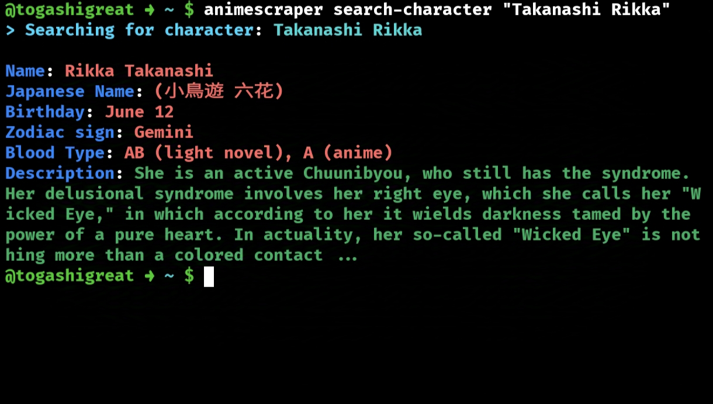
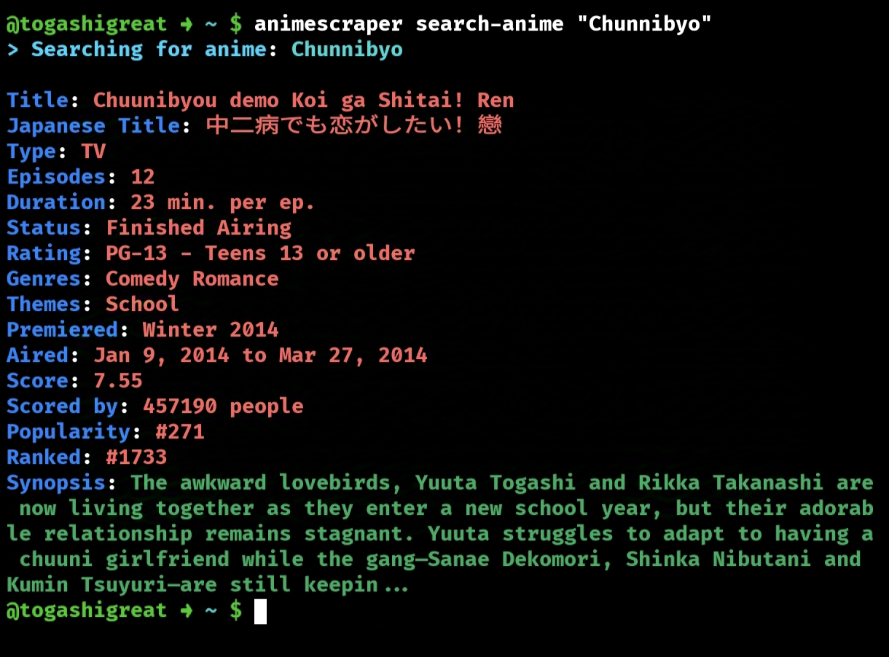

<div align="center">

# AnimeScraper


**AnimeScraper** is an Open Source Python library designed for scraping and parsing anime-related data from MyAnimeList. With support for asynchronous requests, it allows you to fetch detailed information about anime, characters, and more efficiently.

</div>


## 🚀 Features

- Fetch detailed anime and character details
- Asynchronous Fast data retrieval
- Caching 
- Easy-to-use API
- Fully typed and documented
- Supports Synchronous as well
- Comes with a Cli too
- FastAPI Server with Caching config 


## 🛠️ Installation

You can install AnimeScraper using pip:

```bash
pip install animescraper
```

## Cli Tool
You can use AnimeScraper in your command line too. Type `animescraper` for Usage. Available commands `search-anime`, `get-anime`, `search-character` etc. look at the Documentation for more information.

**Example:**

<div align="center">




</div>


## 📖 Quick Start

### Synchronous

This library supports both Synchronous and Asynchronous.

**Searching and Fetching Anime**

```python
from AnimeScraper import SyncKunYu

scraper = SyncKunYu()
anime = scraper.search_anime("Chuunibyo demo koi ga shita")

print(anime.title)
print(anime.stats.rank)

```
**Searching and fetching Character**

```python
from AnimeScraper import SyncKunYu

scraper = SyncKunYu()
character = scraper.search_character("Takanashi Rikka")

print(character.about)
print(character.description)
```


### Asynchronous


**Searching Anime** 

```python
import asyncio
from AnimeScraper import KunYu

async def main():
    scraper = KunYu()
    anime = await scraper.search_anime("violet evergarden")  # Violet Evergarden
    print(anime.title)
    print(anime.synopsis)
    print(anime.characters[0].name)

asyncio.run(main())
```


**Searching Character** 

```python
import asyncio
from AnimeScraper import KunYu

async def main():
    scraper = KunYu()
    # Search and Fetch Character detials by name
    character = await scraper.search_character("Killua Zoldyck")
    print(character.name)
    print(character.url)

asyncio.run(main())
```


**Fetching Anime details**

```python
import asyncio
from AnimeScraper import KunYu

async def main():
    # Use async Context manager to fetch multiple anime with same session
    async with KunYu() as scraper:
        anime = await scraper.get_anime("32281")  # Fullmetal Alchemist: Brotherhood
        print(anime.stats.score)
        print(anime.characters[0].name)

asyncio.run(main())

```

## 📖 Documentation

Detailed documentation is available. [Check out the Documentation](https://animescraper.readthedocs.io/en/latest/)

## 🌟 Key Components

- `KunYu`: Main interface for scraping anime and character data
- `Anime`: Detailed anime information model
- `Character`: Comprehensive character details model
- Asynchronous scraping with `aiohttp`


## 🔧 Requirements

- Python 3.10+
- aiohttp
- httpx
- pydantic
- uvicorn 

## 📦 Project Structure

```
AnimeScraper/
│
├── AnimeScraper/
│   ├── Scraper.py       # Main scraping interface
│   ├── _model.py        # Data models
│   ├── malscraper.py    # HTTP connection handler
│   └── _parse_anime_data.py  # HTML parsing utilities
│
├── docs/                # Sphinx documentation
├── tests/               # Unit tests
└── pyproject.toml       # Project configuration
```
## 📄 License

Distributed under the GPL-V3.0 License. See [LICENSE](./LICENSE.md) for more information.

## 📞 Contact

[Facebook](https://facebook.com/KiyotakaO.O)
[Telegram](t.me/togayuuta)
